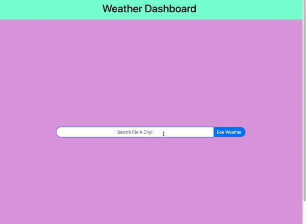

# Weather Dashboard (Server Side APIs)

## Objective

Build a weather dashboard that retrieves the weather outlook for multiple cities. This application will run in the browser and feature dynamically updated HTML and CSS.

## User Story (Concept)

```
AS A traveler
I WANT to see the weather outlook for multiple cities
SO THAT I can plan a trip accordingly
```

## Brief & Acceptance Criteria

```
GIVEN a weather dashboard with form inputs
WHEN I search for a city
THEN I am presented with current and future conditions for that city and that city is added to the search history
WHEN I view current weather conditions for that city
THEN I am presented with the city name, the date, an icon representation of weather conditions, the temperature, the humidity, the wind speed, and the UV index
WHEN I view the UV index
THEN I am presented with a color that indicates whether the conditions are favorable, moderate, or severe
WHEN I view future weather conditions for that city
THEN I am presented with a 5-day forecast that displays the date, an icon representation of weather conditions, the temperature, and the humidity
WHEN I click on a city in the search history
THEN I am again presented with current and future conditions for that city
```

## Mock-Up

The following animation demonstrates the application functionality:



## Tools Implemented

* Bootstrap

* jQuery

* [OpenWeather API](https://openweathermap.org/api)

## Challenges

* Passing value of `var userInput` when search button is clciked on main homepage to `getWeather()` function called once search-results.html file is loaded.<br>
    **Solution:** Saving value of `var userInput` and `var userCityInputNoSpaces` to local storage.

* Search History Buttons: (1) preventing search buttons from repeating with each new search, and (2) removing all buttons when the Clear Search History Button is clicked. <br>
    **Solution:** `detach()` method.

## Link to Website

* [Weather Dashboard](https://e-burton.github.io/Weather-Dashboard-Server-Side-APIs/)

## Additional Resources used for Finished Project

* [How to Create Search Button Icon](https://www.w3schools.com/howto/howto_css_search_button.asp)

* [CSS Rounded Corners](https://www.w3schools.com/css/css3_borders.asp)

* [Forcing Flex Items to Span Entire Row](https://stackoverflow.com/questions/48101046/force-flex-item-to-span-full-row-width#:~:text=2%20Answers&text=When%20you%20want%20a%20flex,now%20consumes%20all%20available%20space.)

* [Convert Unix Timestap to Calendar Date in moment.js](https://stackoverflow.com/questions/20943089/how-to-convert-unix-timestamp-to-calendar-date-moment-js/20943421)

* [How to Replace White Space in JavaScript](https://flaviocopes.com/how-to-replace-whitespace-javascript/)

* [Displaying Special Symbols in JavaScript](http://www.javascripter.net/faq/mathsymbols.htm)

* [A Guide to the UV Index](https://www.epa.gov/sites/production/files/documents/uviguide.pdf)

* [Highligting Text](https://www.computerhope.com/issues/ch001391.htm#both)

* [Set Text Background Color in jQuery](https://www.tutorialspoint.com/How-to-set-background-color-in-jQuery)

* [jQuery detach()](https://www.w3schools.com/jquery/html_detach.asp)

* [Delegated Event Handlers](https://stackoverflow.com/questions/18189948/jquery-button-click-function-is-not-working)

* [Remove Duplicates from an Array of Objects](https://stackoverflow.com/questions/2218999/remove-duplicates-from-an-array-of-objects-in-javascript)

* [Get Last Item from Array](https://stackoverflow.com/questions/3216013/get-the-last-item-in-an-array)

* [Capitalize First Letter of Each Word as User is Typing](https://www.c-sharpcorner.com/blogs/how-to-uppercase-or-capitalize-first-letter-of-each-word-using-jquery)

* [Capitalize Each Word of String](https://www.w3resource.com/javascript-exercises/javascript-string-exercise-9.php)